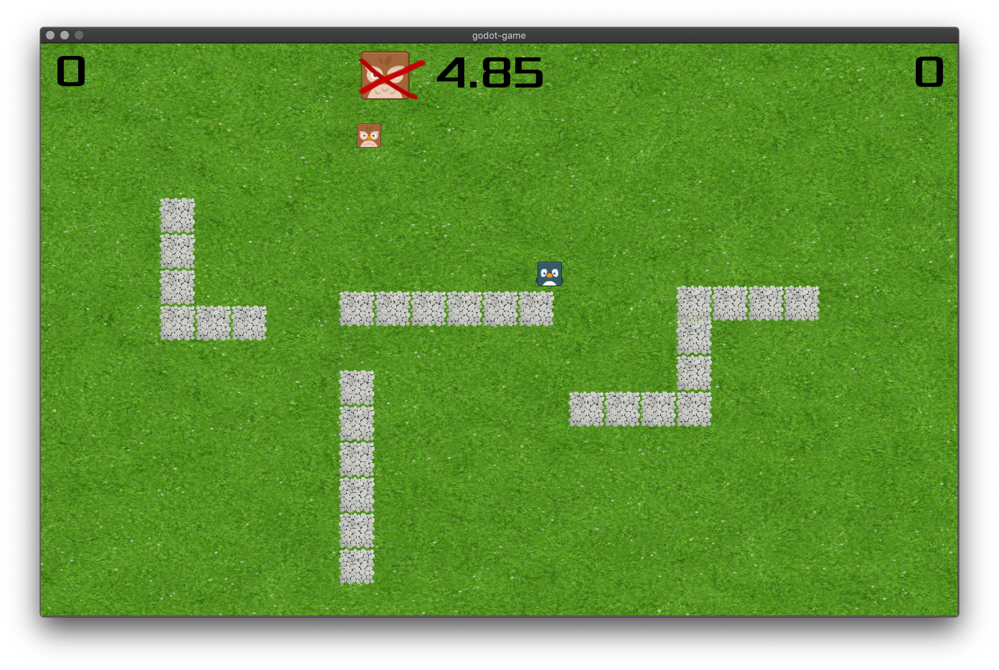

# Overview

This is a small *code-and-learn-everything-in-one-day* game written with [Godot](https://godotengine.org/). Basically I wanted to experiment with
a low-complexity game engine and was quite surprised how fast my progress was given the fact that **I did not know anything about Godot, game engines, GDscript, ... approximately 36 hours before**. I would definitely use this engine again for playing around with some of my game ideas. Features include:

- Gamepad support
- Fullscreen mode
- Background music (not shown in the gif ;-))
- Collision detection
- Awesome gameplay (...subjective!)

The game allows two players to play catch. After 5 seconds, sides are switched, i.e. only one is able to catch the other in the given timeframe. 
